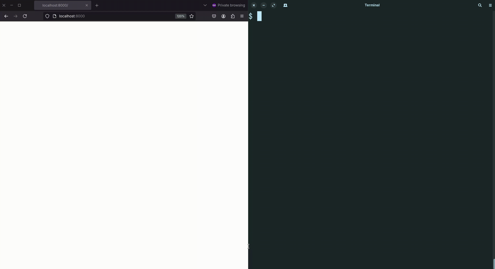

# HTTP Callbacks (a.k.a. Webhooks)


```bash
pip install -r requirements.txt
./main.py
```

In this example we are creating a HTTP server that has two routes:
1. `GET /` - triggers the creation of submission on Judge0
2. `PUT /callback` - called by Judge0 once the submission is done

When you run the HTTP server you should visit `http://localhost:8000` and that will create a new submission on Judge0. This submission will have a `callback_url` attribute set which Judge0 will call `PUT` HTTP verb once the submission is done.

For this to work the `callback_url` must be publicly accessible, so in this example we are using a free service https://localhost.run that allows us to expose your local HTTP server and make it available on the internet and accessible by Judge0.

Once the submission is done Judge0 will call our second route `PUT /callback` and in your terminal you should see the result.
